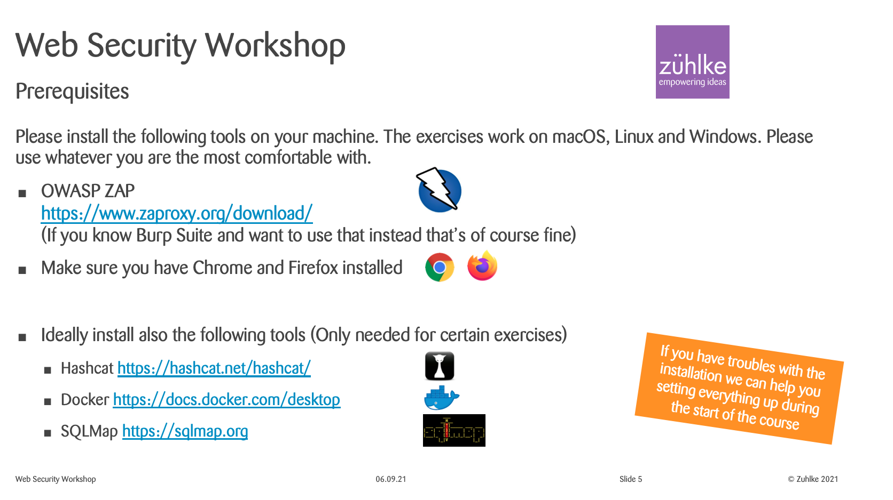

# Zühlke Web Security Workshop

In this repo you can find all the infos and code samples from the web security workshop. `Don't trust my input";--` This is our course motto.


## Content

```txt
/demos        Contains the code from the demos
/solutions    Spoiler: Contains solutions for some of the challenges
```

## Prerequisites

